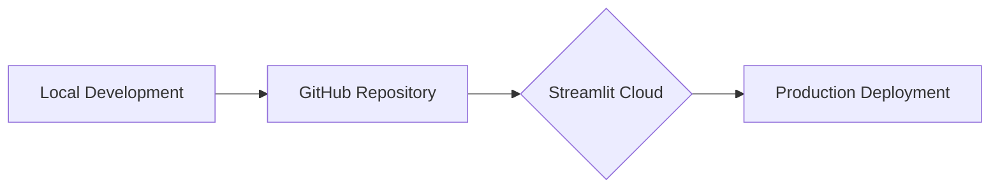

# 🌍 AirSuraksha: Real-time Air Quality Dashboard


[](https://airsuraksha-aqi-dashboard.streamlit.app/)
[](https://github.com/yourusername/INDIA-AQI-DASHBOARD)

## 📚 Table of Contents
- [Project Overview](#-project-overview)
- [Key Features](#-key-features)
- [Technology Stack](#-technology-stack)
- [Installation](#-installation)
- [User Guide](#-user-guide)
- [Data Sources](#-data-sources)
- [Deployment](#-deployment)
- [Future Roadmap](#-future-roadmap)
- [Contributing](#-contributing)
- [License](#-license)

## 🚀 Project Overview
AirSuraksha transforms complex air quality data into actionable insights through:
- Interactive visualization of pollution trends
- Comparative analysis across cities
- Temporal pattern recognition
- Meteorological correlation studies

Designed for researchers, policymakers, and environmentally conscious citizens.

## 🌟 Key Features
| Feature | Description | 
|---|---|
| 📊 Dynamic Charts | Interactive time-series visualization of AQI metrics |
| 🏙 City Comparison | Side-by-side analysis of pollution levels across cities |
| ⏳ Temporal Analysis | Daily/Monthly/Annual trend visualization |
| 🌦 Weather Correlation | Heatmaps showing pollution-meteorology relationships |
| 🖥 Responsive Design | Optimized for desktop and mobile viewing |

## 🛠 Technology Stack
**Core Components**
```bash
Python 3.10+
└── Streamlit
├── Pandas
├── NumPy
└── Plotly
```

**Infrastructure**


## 💻 Installation
```bash
# Clone repository
git clone https://github.com/yourusername/INDIA-AQI-DASHBOARD.git
cd INDIA-AQI-DASHBOARD

# Create virtual environment
python -m venv venv
source venv/bin/activate  # Windows: venv\Scripts\activate

# Install dependencies
pip install -r requirements.txt

# Launch application
streamlit run app.py
```

## 📖 User Guide
1. **City Selection**  
   Use sidebar dropdown to choose target cities
2. **Timeframe Filtering**  
   Select date range using calendar picker
3. **Chart Interaction**  
   - Hover for detailed metrics
   - Toggle legend items
   - Download PNG using plot controls
4. **Comparison Mode**  
   Select multiple cities for side-by-side analysis

## 📂 Data Sources
- Primary Dataset: [Indian Cities AQI (2020-2024)](https://www.kaggle.com/datasets/rajanbhateja/indian-cities-aqi-2020-2024)
- Meteorological Data: OpenWeatherMap API Integration
- Government Reports: CPCB Air Quality Bulletins

## ☁ Deployment


## 🔮 Future Roadmap
- [ ] Machine Learning Integration (AQI Forecasting)
- [ ] Real-time API Data Feeds
- [ ] User Authentication System
- [ ] Mobile Optimization
- [ ] Multilingual Support

## 🤝 Contributing
We welcome contributions! Please follow our [contribution guidelines](CONTRIBUTING.md).

## 📜 License
MIT License - See [LICENSE](LICENSE) for details.

---
**Connect with the Project**  
[🌐 Live Demo](https://airsuraksha-aqi-dashboard.streamlit.app) | 
[📁 Dataset](https://www.kaggle.com/datasets/rajanbhateja/indian-cities-aqi-2020-2024) | 
[💻 GitHub Repo](https://github.com/yourusername/INDIA-AQI-DASHBOARD)
